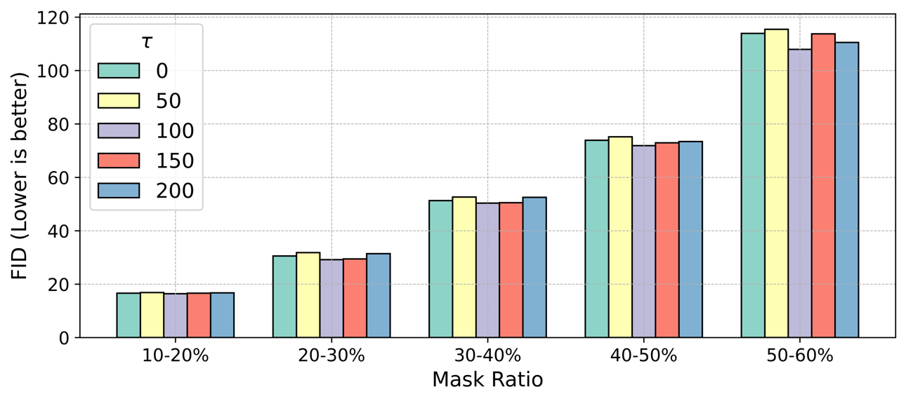
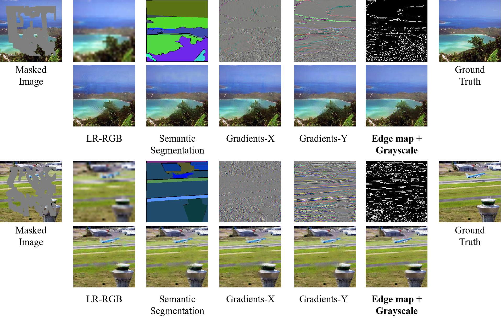
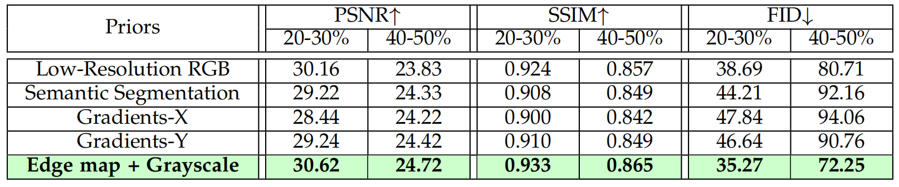

# ConvInpaint-TSGL
### [Paper]() | [BibTex]()

This repository is the official code for the paper "Thinking inside the Convolution for Image Inpainting: Reconstructing Texture via Structure under Global and Local Side" by Haipeng Liu (hpliu_hfut@hotmail.com), Yang Wang (corresponding author: yangwang@hfut.edu.cn), Biao Qian, Yong Rui, Meng Wang. 

## 📚 Table of Contents

- [📖 Introduction]()
- [🔧 TSGL (MEDFE)](https://github.com/htyjers/ConvInpaint-TSGL?tab=readme-ov-file#-tsglmedfe-for-256--256)
- [🔨 TSGL (LaMa)](https://github.com/htyjers/ConvInpaint-TSGL?tab=readme-ov-file#-tsgllama-for-512--512)
- [📊 Experimental Results](https://github.com/htyjers/ConvInpaint-TSGL?tab=readme-ov-file#-experimental-results)
- [🔖 Citation]()


<details close>
<summary><h1>📖 Introduction</h1></summary>

</details>


<details open>
<summary><h1>🔧 TSGL(MEDFE) [For 256 * 256]</h1></summary>
For convenience, I wrote independent code for each model.
	
## 1. Dependencies
* OS: Ubuntu 20.04.6
* nvidia :
	- cuda: 12.3
	- cudnn: 8.5.0
* python3
* pytorch >= 1.13.0
* Python packages:
  ```bash
  pip install -r TSGL_MEDFE/requirements.txt
  ```

## 2. Dataset Preparation
### Image Dataset -- [RGB Image]
Our model is trained on the three typical datasets: 
  * [Paris Street View](https://github.com/pathak22/context-encoder)
  * [CelebA](http://mmlab.ie.cuhk.edu.hk/projects/CelebA.html)
  * [Places2 (256 * 256)](http://places2.csail.mit.edu/)

### Structure Dataset -- [Edge Map]
We employ the canny edge detector to construct the edge map and the grayscale counterpart. **The training and testing code already includes this part.**
  ```python
  from skimage.feature import canny
  from skimage.color import gray2rgb, rgb2gray
  
  gray_image = rgb2gray(np.array(tensor_to_image()(image)))
  edge = image_to_tensor()(Image.fromarray(canny(gray_image, sigma=sigma)))
  gray_image = image_to_tensor()(Image.fromarray(gray_image))
  ```

### Texture Dataset -- [RTV Image]
For RTV image, we utlize the [RTV smooth method](http://www.cse.cuhk.edu.hk/~leojia/projects/texturesep/). Run generation function [data/Matlab/generate_structre_images.m](./data/Matlab/generate_structure_images.m) in your matlab. For example, if you want to generate smooth images for **RGB Image**, you can run the following code:
```matlab
generate_structure_images("path to RGB image dataset root", "path to output RTV image folder");
```

### Mask Dataset -- [Irregular Mask Dataset]
Our model is trained on the irregular mask dataset provided by [PartialConv](https://arxiv.org/abs/1804.07723). You can download publically available Irregular Mask Dataset from their [website](http://masc.cs.gmu.edu/wiki/partialconv).

### The File Tree Structure
```bash
📂 YourDatasetPath
├── 📁 RGB (Strictly adhere to this naming; do not change.)
│   ├── 📁 Train
│   │   ├── 🖼 image1.jpg
│   │   ├── 🖼 image2.jpg
│   ├── 📁 Test
│   │   ├── 🖼 image3.jpg
│   │   ├── 🖼 image4.jpg
├── 📁 RTV (Strictly adhere to this naming; do not change.)
│   ├── 📁 Train
│   │   ├── 🖼 image1.jpg (The name of each RTV image matches the corresponding RGB image.)
│   │   ├── 🖼 image2.jpg
│   ├── 📁 Test
│   │   ├── 🖼 image3.jpg
│   │   ├── 🖼 image4.jpg
├── 📁 Mask
│   ├── 🖼 00000.jpg
│   ├── 🖼 00001.jpg
└── ...
```

## 3. Train
### Dataset Path
* RTV data path: 
  https://github.com/htyjers/ConvInpaint-TSGL/blob/ce13c18b0580286b9db7e26317d92a3dc2a832f5/TSGL_MEDFE/train/run_train.py#L9
* RGB data path: Following the file tree structure, the training and testing code will automatically read the desired RGB images.
  https://github.com/htyjers/ConvInpaint-TSGL/blob/ce13c18b0580286b9db7e26317d92a3dc2a832f5/TSGL_MEDFE/train/dataset_loader.py#L21-L23
* Mask data path:
  https://github.com/htyjers/ConvInpaint-TSGL/blob/ce13c18b0580286b9db7e26317d92a3dc2a832f5/TSGL_MEDFE/train/run_train.py#L10
  
### Run the following command
```python
Python3 TSGL_MEDFE/train/run_train.py
```

## 4. Test
### Dataset Path
* RTV data path
  https://github.com/htyjers/ConvInpaint-TSGL/blob/ce13c18b0580286b9db7e26317d92a3dc2a832f5/TSGL_MEDFE/test/run_train.py#L9
* RGB data path: Following the file tree structure, the training and testing code will automatically read the desired RGB images.
  https://github.com/htyjers/ConvInpaint-TSGL/blob/ce13c18b0580286b9db7e26317d92a3dc2a832f5/TSGL_MEDFE/test/dataset_loader.py#L21-L23
* Mask data path
  https://github.com/htyjers/ConvInpaint-TSGL/blob/ce13c18b0580286b9db7e26317d92a3dc2a832f5/TSGL_MEDFE/test/run_train.py#L10

### Pre-trained models
* Download the pre-trained model
	- [Places2](https://pan.baidu.com/s/18yHf01_hHI6Nu7BnlDSQ9w?pwd=6v9k)
* pre-trained model path
  https://github.com/htyjers/ConvInpaint-TSGL/blob/bb07abda12b364d6d0460d27e1cc78d29093233b/TSGL_MEDFE/test/test.py#L50
  
### Run the following command
```python
Python3 TSGL_MEDFE/test/run_train.py
```

## 5. Acknowledgments
This implementation is based on / inspired by:
* [https://github.com/NVlabs/SPADE](https://github.com/NVlabs/SPADE) (SPADE)
* [https://github.com/fenglinglwb/MAT](https://github.com/fenglinglwb/MAT) (MAT)
* [https://github.com/KumapowerLIU/Rethinking-Inpainting-MEDFE](https://github.com/KumapowerLIU/Rethinking-Inpainting-MEDFE) (MEDFE)

</details>

<details open>
<summary><h1>🔨 TSGL(LaMa) [For 512 * 512]</h1></summary>
For convenience, I wrote independent code for each model.
	
## 1. Dependencies
* OS: Ubuntu 20.04.6
* nvidia :
	- cuda: 12.3
	- cudnn: 8.5.0
* python3
* pytorch >= 1.13.0
* Python packages: 
  ```bash
  pip install -r TSGL_Lama/requirements.txt
  ```
  
## 2. Dataset Preparation
### Image Dataset -- [RGB Image]
Our model is trained on one dataset: 
  * [Places2 (512 * 512)](http://places2.csail.mit.edu/)
### Structure Dataset -- [Edge Map]
We employ the canny edge detector to construct the edge map and the grayscale counterpart. **The training and testing code already includes this part.**
  ```python
  from skimage.feature import canny
  from skimage.color import gray2rgb, rgb2gray
  
  gray_image = rgb2gray(np.array(tensor_to_image()(image)))
  edge = image_to_tensor()(Image.fromarray(canny(gray_image, sigma=sigma)))
  gray_image = image_to_tensor()(Image.fromarray(gray_image))
  ```
### Mask Dataset -- [Lama Mask Dataset]
Our model is trained on the lama mask dataset provided by [LaMa](https://arxiv.org/abs/2109.07161). You can create the mask dataset from their [website](https://github.com/advimman/lama?tab=readme-ov-file).

### The File Tree Structure
* Since the RTV smooth method is time-consuming for processing RGB images, especially for a 512x512 image, we substitute it with the RGB image.
```bash
📂 YourDatasetPath
├── 📁 RGB
│   ├── 📁 Train
│   │   ├── 🖼 image1.jpg
│   │   ├── 🖼 image2.jpg
│   ├── 📁 Test
│   │   ├── 🖼 image3.jpg
│   │   ├── 🖼 image4.jpg
├── 📁 Mask
│   ├── 🖼 00000.jpg
│   ├── 🖼 00001.jpg
└── ...
```

## 3. Train
### Dataset Path
* RGB data path
  https://github.com/htyjers/ConvInpaint-TSGL/blob/788a382c97274f7ae7609742018e0b904eb2933e/TSGL_Lama/train/run_train.py#L9
* Mask data path
  https://github.com/htyjers/ConvInpaint-TSGL/blob/788a382c97274f7ae7609742018e0b904eb2933e/TSGL_Lama/train/run_train.py#L10
  
### Run the following command
```python
Python3 TSGL_Lama/train/run_train.py
```

## 4. Test
### Dataset Path
* RGB data path
  https://github.com/htyjers/ConvInpaint-TSGL/blob/788a382c97274f7ae7609742018e0b904eb2933e/TSGL_Lama/test/run_train.py#L9
* Mask data path
  https://github.com/htyjers/ConvInpaint-TSGL/blob/788a382c97274f7ae7609742018e0b904eb2933e/TSGL_Lama/test/run_train.py#L10

### Pre-trained model
* Download the pre-trained model
	- [Places2](https://pan.baidu.com/s/18yHf01_hHI6Nu7BnlDSQ9w?pwd=6v9k): Trained on Places365-Standard Test Dataset
* pre-trained model path
https://github.com/htyjers/ConvInpaint-TSGL/blob/788a382c97274f7ae7609742018e0b904eb2933e/TSGL_Lama/test/test.py#L43
  
### Run the following command
```python
Python3 TSGL_Lama/test/run_train.py
```

## 5. Acknowledgments
This implementation is based on / inspired by:
* [https://github.com/NVlabs/SPADE](https://github.com/NVlabs/SPADE) (SPADE)
* [https://github.com/advimman/lama?tab=readme-ov-file](https://github.com/advimman/lama?tab=readme-ov-file) (LaMa)
  
</details>


<details open>
<summary><h1>📊 Experimental Results</h1></summary>

* Ablation study about hyperparameter τ under varied mask ratios on PSV, Our method, i.e., τ = 100, achieves the best results.

	
* Ablation study about comparing the final inpainted results using various priors on ADE20K with irregular masks reveals that our **Edge map + Grayscale** approach yields the most desirable inpainting results compared to other methods.


*  Ablation study about several priors as the structure information on ADE20K dataset. Our method, i.e., **Edge map + Grayscale**, achieves the best results (reported with boldface).



</details>

<details open>
<summary><h1>🔖 Citation</h1></summary>

</details>
